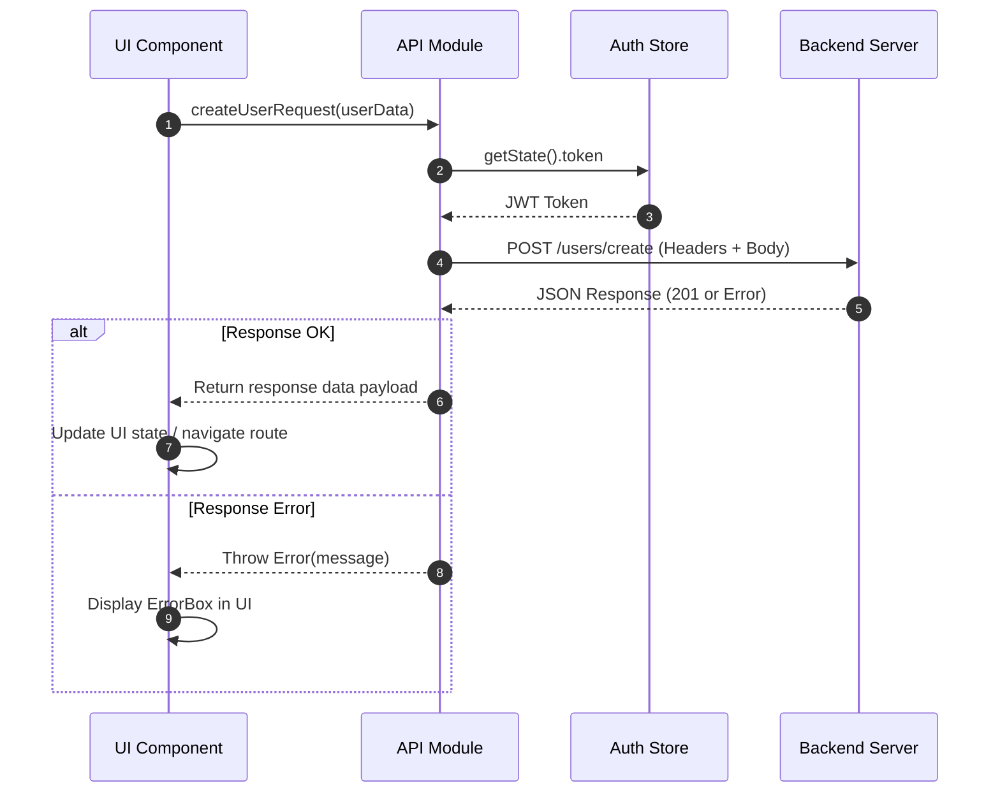

# Frontend API Integration Guide

This document explains how API integration works in the Specora frontend from an user action/request all the way to the UI update.

---

## 1. Architectural Overview

The frontend follows a **modular layer pattern** for API communication. UI components do not make raw `fetch` or `axios` calls directly; instead, they call specialized API helper functions defined in `src/api/`.

```text
+-----------------------+        +--------------------+        +--------------------+        +------------------------+
|     UI Component      |        |     API Module     |        |     Auth Store     |        |     Backend Server     |
| (e.g. UserInfo.jsx)   |        | (src/api/users.js) |        |   (authStore.js)   |        |   (Express / Node)     |
+-----------------------+        +--------------------+        +--------------------+        +------------------------+
            |                              |                            |                                    |
            |-- 1. createUserRequest(data)->|                            |                                    |
            |                              |-- 2. getState().token ---->|                                    |
            |                              |<-- 3. JWT Token -----------|                                    |
            |                              |                                                                 |
            |                              |-- 4. POST /users/create (Header: Bearer Token) ----------------->|
            |                              |<-- 5. JSON Response (201 Created OR Error) ---------------------|
            |                              |                                                                 |
            |                              |==== [IF RESPONSE OK] ===========================================|
            |<-- 6a. Return Data Payload --|                                                                 |
            | (Redirects / Updates UI)     |                                                                 |
            |                              |==== [IF RESPONSE ERROR] ========================================|
            |<-- 6b. Throws Error(message) |                                                                 |
            | (Renders ErrorBox)           |                                                                 |
```



---

## 2. Key Architecture Standards

### Centralized API Modules (`src/api/*`)
All API endpoints are grouped by resource within `src/api/` (e.g., [users.js](../../fe/src/api/users.js), [auth.js](../../fe/src/api/auth.js), [projects.js](../../fe/src/api/projects.js), [rbac.js](../../fe/src/api/rbac.js)).

### Dynamic Token Injection
Authenticated requests fetch the latest JWT token directly from the Zustand auth store state using `useAuthStore.getState().token` without requiring hooks inside non-React functions:
```javascript
const { token } = useAuthStore.getState();
```

### Environment Variables & Client Inlining (`process.env.NEXT_PUBLIC_*`)
Even though browsers do not have a native Node.js `process` object, Next.js handles `process.env.NEXT_PUBLIC_API_URL` during compilation/build time (see [Next.js Official Documentation — Environment Variables](https://nextjs.org/docs/app/building-your-application/configuring/environment-variables)):
1. **Static Build-Time Inlining**: The Next.js bundler (Webpack/Turbopack) scans client-side code and statically replaces `process.env.NEXT_PUBLIC_API_URL` with its literal string value defined in `.env` (e.g. `"http://localhost:5000/api"`).
2. **Compiled Output**: In the production JS bundle sent to the browser, `const API_BASE = process.env.NEXT_PUBLIC_API_URL;` is compiled to:
   ```javascript
   const API_BASE = "http://localhost:5000/api";
   ```
3. **Security Prefix (`NEXT_PUBLIC_`)**: Only environment variables starting with `NEXT_PUBLIC_` are exposed to the browser bundle. Variables without this prefix remain server-only and evaluate to `undefined` in client code.

### Defensive Response & Error Handling
Every request function follows a strict 3-tier error handling workflow:
1. **Safe JSON Parsing**: Wrapped in `try/catch` to prevent syntax crashes if the backend returns non-JSON HTML (e.g., 502 Bad Gateway).
2. **HTTP Status Verification**: Check `!res.ok` and throw an explicit `Error` containing server error messages (`data?.message`).
3. **Network Failure Catching**: Fallback error handling for network timeouts or disconnection.

---

## 3. Complete End-to-End Example: User Creation Flow

Here is a complete example tracing the User Creation request from UI trigger to completion.

### Step 1: The API Helper Module
Located at [src/api/users.js](../../fe/src/api/users.js):

```javascript
import useAuthStore from "@/store/authStore";

const API_BASE = process.env.NEXT_PUBLIC_API_URL;

export async function createUserRequest(userData) {
  try {
    // 1. Extract bearer token from Zustand auth store
    const { token } = useAuthStore.getState();

    // 2. Dispatch HTTP Request
    const res = await fetch(`${API_BASE}/users/create`, {
      method: "POST",
      headers: {
        "Content-Type": "application/json",
        Authorization: `Bearer ${token}`,
      },
      body: JSON.stringify(userData),
    });

    // 3. Defensive JSON response parsing
    let responseData;
    try {
      responseData = await res.json();
    } catch (parseError) {
      throw new Error("Server response is invalid. Please try again later.");
    }

    // 4. Check HTTP status code
    if (!res.ok) {
      throw new Error(
        responseData?.message || `User creation failed${res.status ? ` (${res.status})` : ""}`
      );
    }

    // 5. Return payload to caller
    return responseData;
  } catch (err) {
    // 6. Normalize and re-throw error for UI consumption
    if (err instanceof Error) {
      throw err;
    }
    throw new Error(err?.message || "Network error. Please check your connection and try again.");
  }
}
```

### Step 2: The UI Component Integration
Located at [src/components/users/UserInfo.jsx](../../fe/src/components/users/UserInfo.jsx):

```javascript
"use client";

import { useState } from "react";
import { useRouter } from "next/navigation";
import { createUserRequest } from "@/api/users";
import ErrorBox from "@/components/common/ErrorBox";

export default function UserInfo({ variant = "create-user" }) {
  const router = useRouter();
  const [formData, setFormData] = useState({ username: "", email: "", role: "client", password: "" });
  const [loading, setLoading] = useState(false);
  const [error, setError] = useState(null);

  const handleSubmit = async (e) => {
    e.preventDefault();
    setLoading(true);
    setError(null);

    try {
      // Execute API Integration
      await createUserRequest(formData);
      // On success: redirect back to user listing
      router.push("/users");
    } catch (err) {
      // Catch and present API error message to user
      setError(err.message);
    } finally {
      setLoading(false);
    }
  };

  return (
    <form onSubmit={handleSubmit} className="space-y-4">
      {error && <ErrorBox message={error} dismissible />}
      
      <input
        type="text"
        placeholder="Username"
        value={formData.username}
        onChange={(e) => setFormData({ ...formData, username: e.target.value })}
        required
      />

      <button type="submit" disabled={loading}>
        {loading ? "Creating..." : "Create User"}
      </button>
    </form>
  );
}
```

---

## 4. Summary Checklist for New API Requests

When adding a new API integration endpoint:
1. **Add function to `src/api/<feature>.js`**: Import `useAuthStore` and read `token`.
2. **Set headers**: Pass `"Content-Type": "application/json"` and `Authorization: Bearer ${token}`.
3. **Parse & Check**: Parse JSON safely with inner try/catch, check `!res.ok`, and re-throw standard `Error`.
4. **Invoke in Component/Store**: Handle `loading` and `error` states in UI or Zustand store.
