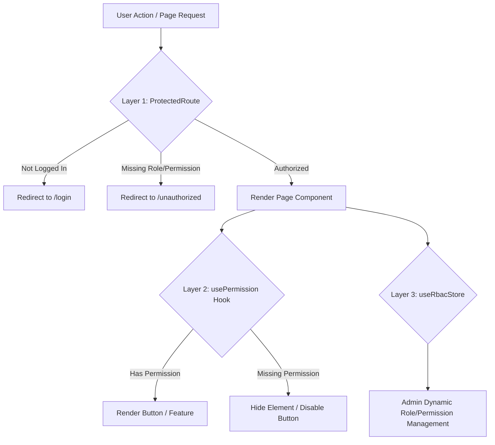

# Frontend Role-Based Access Control (RBAC) Guide

This document explains how roles and permissions are enforced and managed end-to-end across the Specora frontend.

---

## 1. Overview & Data Model

Role-Based Access Control (RBAC) in Specora relies on the active user payload stored in `useAuthStore`. The user object contains both high-level roles and discrete permission strings:

```json
{
  "id": "usr_123",
  "username": "johndoe",
  "role": "manager",
  "permissions": [
    "view_users",
    "add_user",
    "edit_user",
    "delete_user",
    "create_project"
  ]
}
```

---

## 2. 3-Layer Permission Security Model

```text
                     [ User Action / Navigation ]
                                  │
                                  ▼
                ┌──────────────────────────────────┐
                │   Layer 1: Route Guard           │
                │   (ProtectedRoute component)     │
                └──────────────────────────────────┘
                                  │
           ┌──────────────────────┼──────────────────────┐
           ▼                      ▼                      ▼
  [ Not Authenticated ]   [ Role/Perm Missing ]    [ Authorized ]
           │                      │                      │
           ▼                      ▼                      ▼
  Redirect to /login    Redirect to /unauthorized   Render Page Component
                                                         │
                                                         ▼
                                        ┌──────────────────────────────────┐
                                        │   Layer 2: Feature Guard         │
                                        │   (usePermission custom hook)    │
                                        └──────────────────────────────────┘
                                                         │
                                                ┌────────┴────────┐
                                                ▼                 ▼
                                         [ Has Permission ]  [ Missing ]
                                                │                 │
                                                ▼                 ▼
                                          Render Action Button  Hide Element
```



---

## 3. Core RBAC Mechanisms & Code Implementation

### Layer 1: Route Guard (`ProtectedRoute.jsx`)
Located at [src/components/auth/ProtectedRoute.jsx](../../fe/src/components/auth/ProtectedRoute.jsx).

```javascript
"use client";

import { useEffect } from "react";
import { useRouter } from "next/navigation";
import useUserStore from "@/store/authStore";

export default function ProtectedRoute({ children, allowedRoles = [], requiredPermissions = [] }) {
  const { user } = useUserStore();
  const router = useRouter();

  useEffect(() => {
    // 1. Not logged in -> Redirect to login
    if (!user) {
      setTimeout(() => {
        if (!useUserStore.getState().user) {
          router.replace("/login");
        }
      }, 2000);
      return;
    }

    // 2. Role check -> Redirect if role not allowed
    if (allowedRoles.length > 0 && !allowedRoles.includes(user.role)) {
      router.replace("/unauthorized");
      return;
    }

    // 3. Permission check -> Redirect if required permissions are missing
    if (requiredPermissions.length > 0 && !requiredPermissions.every((perm) => user.permissions.includes(perm))) {
      router.replace("/unauthorized");
      return;
    }
  }, [user, allowedRoles, requiredPermissions, router]);

  // Block rendering until authorized
  if (
    !user ||
    (allowedRoles.length > 0 && !allowedRoles.includes(user.role)) ||
    (requiredPermissions.length > 0 && !requiredPermissions.every((perm) => user.permissions.includes(perm)))
  ) {
    return null;
  }

  return children;
}
```

---

### Layer 2: Feature & Element Guards (`usePermission.js`)
Located at [src/hooks/usePermission.js](../../fe/src/hooks/usePermission.js).

```javascript
import useAuthStore from "@/store/authStore";

/**
 * Check if current user possesses a specific permission
 */
export function usePermission(permission) {
  const { user } = useAuthStore();
  return user?.permissions?.includes(permission) ?? false;
}

/**
 * Check if current user possesses ALL specified permissions
 */
export function usePermissions(...permissions) {
  const { user } = useAuthStore();
  const userPerms = user?.permissions || [];
  return permissions.every((p) => userPerms.includes(p));
}
```

---

## 4. Complete End-to-End Example: User Management RBAC

### Scenario:
1. Navigating to `/users/create` requires the `add_user` permission.
2. Navigating to `/users` requires the `view_users` permission.
3. The "Create User" action button inside `/users` is only visible if the user has `add_user` permission.

### Page Route Protection Example (`app/(private)/users/create/page.jsx`)
Located at [src/app/(private)/users/create/page.jsx](../../fe/src/app/(private)/users/create/page.jsx):

```javascript
import UserInfo from "@/components/users/UserInfo";
import ProtectedRoute from "@/components/auth/ProtectedRoute";

export default function CreateUserPage() {
  return (
    // Protect entire route against users without "add_user" permission
    <ProtectedRoute requiredPermissions={["add_user"]}>
      <UserInfo variant="create-user" />
    </ProtectedRoute>
  );
}
```

### Element Protection Example (`app/(private)/users/page.jsx`)
Located at [src/app/(private)/users/page.jsx](../../fe/src/app/(private)/users/page.jsx):

```javascript
"use client";

import ProtectedRoute from "@/components/auth/ProtectedRoute";
import { usePermission } from "@/hooks/usePermission";
import Link from "next/link";

export default function UsersPage() {
  const canCreateUser = usePermission("add_user");

  return (
    <ProtectedRoute requiredPermissions={["view_users"]}>
      <div>
        <h1>User Management</h1>
        
        {/* Only render Create User button if user has 'add_user' permission */}
        {canCreateUser && (
          <Link href="/users/create">
            <button>Create User</button>
          </Link>
        )}

        {/* Users Table */}
      </div>
    </ProtectedRoute>
  );
}
```

---

## 5. RBAC Best Practices Summary

1. **Always enforce on route & element levels**: Wrapping pages with `<ProtectedRoute>` prevents unauthorized URL access, while `usePermission()` prevents confusing UI options from rendering.
2. **Backend is the source of truth**: Frontend RBAC enhances UX and prevents unauthorized actions, but the backend API must still validate JWT permissions for every incoming HTTP request.
