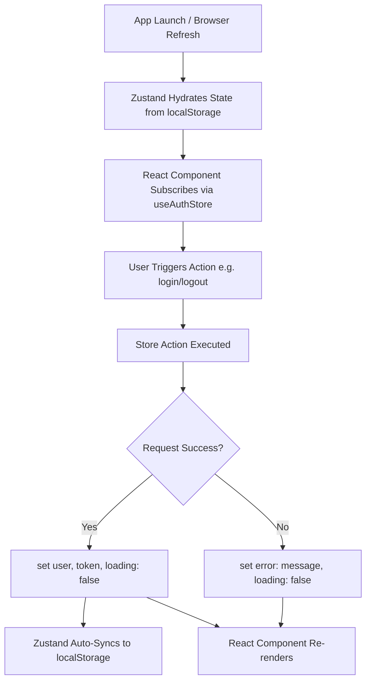

# Frontend State Management Guide

This document explains how frontend state is structured, updated, persisted, and managed from start to finish in the Specora application.

---

## 1. Overview & State Classification

Specora uses **Zustand** as its primary global state management library alongside native React component state for local UI concerns. State is categorized into three distinct tiers:

| Tier | Library / Pattern | Scope & Lifecycle | Examples |
| :--- | :--- | :--- | :--- |
| **Global Persistent State** | Zustand + `persist` middleware | Persists across page reloads & browser sessions (`localStorage`) | User profile, JWT auth token ([authStore.js](../../fe/src/store/authStore.js)) |
| **Global Feature State** | Zustand stores (`create`) | In-memory global state accessible across multiple pages/components | Roles & permissions ([rbacStore.js](../../fe/src/store/rbacStore.js)), Projects list ([projectsStore.js](../../fe/src/store/projectsStore.js)) |
| **Local Component State** | React `useState` / `useReducer` | Ephemeral, alive only while component is mounted | Form input values, search filtering query strings, modal open/close toggles |

---

## 2. State Lifecycle Architecture

```text
[ App Launch / Browser Refresh ]
               │
               ▼
[ Zustand Hydrates State from localStorage (auth-storage) ]
               │
               ▼
[ React Component Subscribes via useAuthStore() ]
               │
               ▼
[ User Triggers Action (e.g., login / logout) ]
               │
               ▼
[ Store Action Triggered & Executes API Request ]
               │
       ┌───────┴───────┐
       ▼               ▼
[ Success ]        [ Failure ]
       │               │
       ▼               ▼
[ set({ user, token }) ]  [ set({ error: msg }) ]
       │               │
       ├───────────────┘
       ▼
[ Zustand Auto-Syncs auth-storage to localStorage ]
       │
       ▼
[ React Component Re-renders Reactively ]
```



---

## 3. Complete End-to-End Example: Authentication State (`useAuthStore`)

The authentication store represents the full lifecycle of global state management: action dispatching, API integration, state mutation, persistence, reactive UI binding, and store reset.

### Step 1: Store Definition & Persistence Setup
Located at [src/store/authStore.js](../../fe/src/store/authStore.js):

```javascript
import { create } from "zustand";
import { persist } from "zustand/middleware";
import { loginRequest, signupRequest, logoutRequest } from "@/api/auth";

const useAuthStore = create(
  persist(
    (set) => ({
      // --- Initial State ---
      user: null,
      token: null,
      loading: false,
      error: null,

      // --- Synchronous Action ---
      updateUser: (newUserData) => set({ user: newUserData }),

      // --- Asynchronous Auth Actions ---
      login: async (credentials) => {
        set({ loading: true, error: null });
        try {
          const data = await loginRequest(credentials);
          set({
            user: data.user,
            token: data.token,
            loading: false,
          });
          return data.user;
        } catch (err) {
          const errorMessage = err?.message || "An unexpected error occurred. Please try again.";
          set({ loading: false, error: errorMessage });
          throw err;
        }
      },

      logout: async () => {
        try {
          await logoutRequest();
        } catch (err) {
          console.error("Logout error:", err);
        } finally {
          // Reset store state
          set({ user: null, token: null, error: null });
          // Clear persisted keys from localStorage
          localStorage.removeItem("auth-storage");
          localStorage.removeItem("projects-storage");
        }
      },
    }),
    {
      name: "auth-storage", // Key name in localStorage
      getStorage: () => localStorage,
    }
  )
);

export default useAuthStore;
```

### Step 2: Component Usage & Subscription
Components consume store state reactively. When `user`, `token`, `loading`, or `error` state changes in the store, subscriber components re-render automatically.

Located in [src/components/layout/Navbar.jsx](../../fe/src/components/layout/Navbar.jsx):

```javascript
"use client";

import useAuthStore from "@/store/authStore";
import { useRouter } from "next/navigation";

export default function Navbar() {
  // Subscribe to user state and logout action
  const { user, logout } = useAuthStore();
  const router = useRouter();

  const handleLogout = async () => {
    await logout();
    router.push("/login");
  };

  return (
    <nav className="flex justify-between p-4">
      <div>Specora App</div>
      {user ? (
        <div className="flex items-center gap-4">
          <span>Welcome, {user.username}</span>
          <button onClick={handleLogout}>Logout</button>
        </div>
      ) : (
        <a href="/login">Login</a>
      )}
    </nav>
  );
}
```

---

## 4. Best Practices for State Management

1. **Keep Local State Local**: Use `useState` for search queries, active tabs, and temporary form inputs. Do not clutter global stores with temporary UI state.
2. **Access Outside React Hooks**: When reading state outside components (e.g. inside API files), use static store getters:
   ```javascript
   const token = useAuthStore.getState().token;
   ```
3. **Clean Up Storage on Logout**: Ensure sensitive persistent stores are explicitly removed from `localStorage` during logout sequences.
